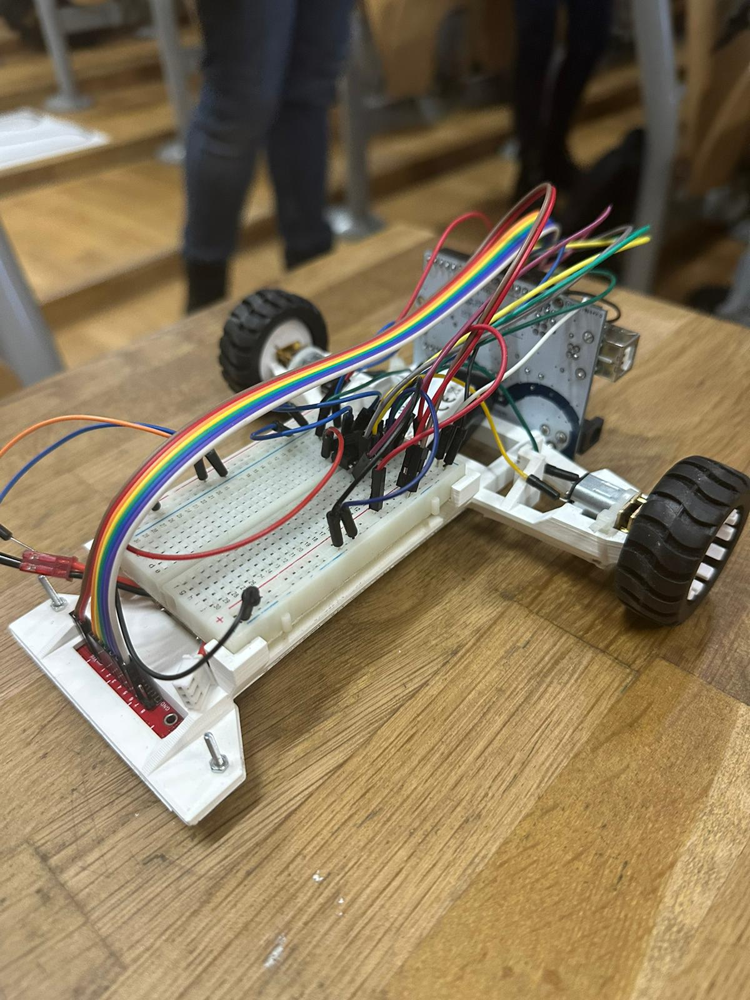

# Line Follower 

### This was the last project of Introduction to Robotics course: Line Follower.

## Description 
 - A line follower project is a robot that is designed to follow a specific path or line 🚗. The robot uses sensors to detect the location of the line and then adjusts its movement accordingly. 
 - We used PID controller 🕹️ - a control loop feedback mechanism that keeps the robot on the line. It uses Proportional, Integral and Derivative to minimize the error. 

## Components 📌
 - Arduino Uno
 - 2 DC motors
 - 2 wheels
 - LiPo Battery
 - QTR-8A reflectance sensor (8 IR array)
 - L293D motor driver
 - wires, breadboard, chassis

 ## Features & Parameters ⚙️
 - We made an automatic calibration for 6 seconds by powering the right motor until the sensor is out of the line and after we power the left motor and so on.
 - Then we move the car left or right until the sensor is centered on the line.
 - We map the error from sensors to [-50, 50] interval and apply PID with kp = 40, ki = 0, kd = 4. 
 - For a better approach in tight turns, we spin one motor forward and the other backwards.

 

 

 

  <h3>
    <a href="https://youtu.be/RLEqACWAsrI">
      ▶️ Click here for video
    </a>
  </h3>

